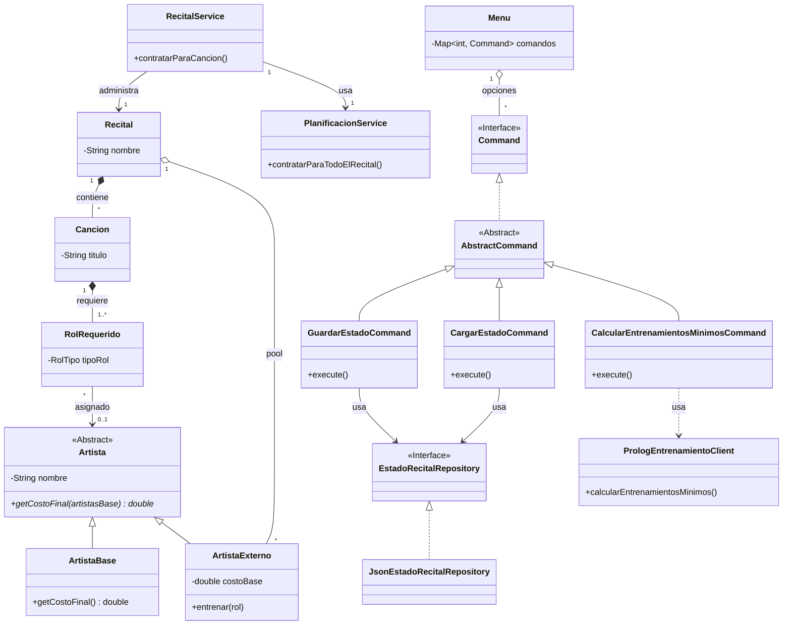

# Sistema de Gestión de Recitales - TP Paradigmas de Programación

   

Este repositorio contiene la solución al Trabajo Práctico de la materia **Paradigmas de Programación (2025)**. El sistema modela la gestión de una banda temporal para una discográfica, resolviendo la asignación de artistas a canciones mediante Programación Orientada a Objetos, algoritmos de optimización y lógica (Prolog).

## 👥 Integrantes del Equipo
* **Ignacio Parra**
---

## 📋 Descripción del Proyecto

El sistema permite administrar la conformación de un recital, combinando **Artistas Base** (fijos y sin costo) con **Artistas Externos** (contratables). El objetivo es cubrir todos los roles necesarios para cada canción minimizando los costos totales y respetando restricciones como la cantidad máxima de canciones por artista.

### Funcionalidades Principales

1.  **Gestión de Canciones y Roles:** Cálculo de roles faltantes por canción y por recital.
2.  **Contratación Manual:** Asignación de artistas a una canción específica optimizando el costo local.
3.  **Contratación Global (Automática):** Algoritmo de optimización para cubrir todo el recital a la vez.
4.  **Entrenamiento:** Capacidad de enseñar nuevos roles a artistas externos (incrementando su costo).
5.  **Persistencia de Estado:** Guardado y carga de estados del recital en archivos JSON.
6.  **Integración con Prolog:** Cálculo de "entrenamientos mínimos" necesarios mediante un motor lógico.

### Funcionalidades Bonus Implementadas
* **Arrepentimiento:** Posibilidad de quitar a un artista ya contratado, liberando sus asignaciones.
* **Artista Estrella:** Aplicación automática de descuentos si el artista coincide con el género del recital.
* **Guardado de Estado:** Persistencia completa del estado del recital para retomarlo luego.

---

## 🏗️ Arquitectura y Diseño

El proyecto sigue una arquitectura en capas con una fuerte separación de responsabilidades, aplicando principios **SOLID**.

### Patrones de Diseño Utilizados

* **Command Pattern:** Utilizado en el menú principal (`Menu`, `Command`, `AbstractCommand`). Permite encapsular cada acción del usuario como un objeto, facilitando la extensión de nuevas opciones sin modificar la clase invocadora.
* **Repository Pattern:** Abstrae la persistencia de datos (`JsonEstadoRecitalRepository`). Permite cambiar el mecanismo de almacenamiento (actualmente JSON con Jackson) sin afectar al dominio.
* **Facade (Fachada):** La clase `RecitalService` actúa como fachada, simplificando la interacción entre la capa de presentación (UI) y la lógica compleja de planificación.
* **DTO (Data Transfer Object):** Se utilizan DTOs (`RecitalEstadoDTO`, etc.) para desacoplar las entidades de dominio de la estructura de persistencia en JSON, evitando ciclos y manteniendo el encapsulamiento.

### Algoritmo de Optimización (Backtracking)

Para la funcionalidad de **"Contratar todo el recital"**, se implementó un algoritmo de **Backtracking** en la clase `PlanificacionService`. Este enfoque explora recursivamente el árbol de decisiones para asignar artistas a roles vacíos, permitiendo encontrar la combinación que minimiza el costo global respetando el límite de `maxCanciones` de cada artista.
La primer versión utilzaba un algoritmo greedy que iba canción por canción y contrataba por cada rol requerido el artista disponible mas barato, esto no aseguraba el menor costo total del recital y el resultado final dependía mucho del orden en que se recorrian las canciones, luego se cambió por el backtracking que garantiza el menor costo total.

### Diagrama de Clases (Mermaid)


---

## 🧠 Integración con Prolog

El sistema integra un módulo lógico para responder preguntas complejas sobre combinatoria de entrenamientos.

* **Archivo:** `src/main/resources/prolog/entrenamientos.pl`
* **Funcionalidad:** Predicado `entrenamientos_minimos/2`.
* **Implementación:** Java calcula la matriz de faltantes y delega a Prolog el cálculo de cuántos entrenamientos serían estrictamente necesarios para cubrir el recital sin contratar más externos. Se utiliza la librería **JPL** para la comunicación.

---

## 🚀 Instalación y Ejecución

### Requisitos Previos
* **Java JDK 21**: El proyecto utiliza características modernas de Java.
* **Maven 3.x**: Para la gestión de dependencias.
* **SWI-Prolog**: Debe estar instalado y configurado en el PATH del sistema (necesario para la librería JPL).

### Pasos para ejecutar

1.  **Clonar el repositorio:**
    ```bash
    git clone https://github.com/parradura/tp-recital-paradigmas
    cd tp-recital-paradigmas
    ```

2.  **Compilar el proyecto:**
    ```bash
    mvn clean install
    ```

3.  **Ejecutar la aplicación:**
    ```bash
    mvn exec:java -Dexec.mainClass="com.grupo_rho.Main"
    ```

---

## 📁 Estructura del Proyecto

```text
src/main/java/com/grupo_rho/
├── domain/          # Lógica de negocio (Recital, Cancion, Artista)
├── persistence/     # Repositorios y DTOs (JSON)
├── service/         # Servicios (Planificacion, RecitalService)
├── ui/              # Interfaz de usuario (Commands, Printer, Menu)
├── integration/     # Cliente JPL para Prolog
└── Main.java        # Punto de entrada
```

---

## ✅ Estado de Entrega
- [x] Funcionalidades Core completas.

- [x] Tests unitarios (JUnit 5) cubriendo escenarios de éxito y fallo.

- [x] Persistencia JSON implementada con Jackson.

- [x] Conexión con Prolog funcionando mediante JPL.

- [x] Bonus 1: Artista Estrella.

- [x] Bonus 2: Guardar/Cargar Estado.

- [x] Bonus 3: Arrepentimiento (Quitar artista).

---

## 📚 Referencias
Refactoring Guru. (s.f.). Patrones de Diseño. Recuperado de https://refactoring.guru/es/design-patterns

JPL7 Documentation. (2024). Java Interface to Prolog. Recuperado de https://jpl7.org/

Jackson Project. (2024). Jackson JSON Processor. GitHub. Recuperado de https://github.com/FasterXML/jackson
